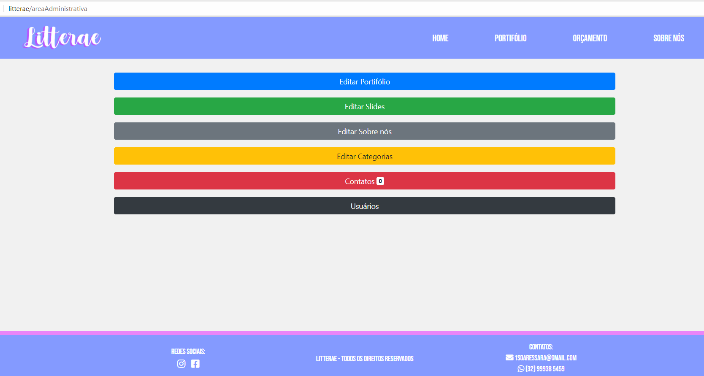

# Litterae - A arte de desenhar letras!
  
 ### [Confira nosso site!](https:/litterae.ga/home)

<h4 align="center"> 
	🚧  Litterae Em desenvolvimento...  🚧
</h4>
 

Site realizado para contriubuir com o trabalho de Sara Soares, e também para me ajudar nos estudos de PHP da faculdade.
A ídeia era ser algo simples, que ela pudesse gerenciar sozinha com uma área administrativa, onde poderia gerenciar todas as publicações realizadas no seu portifólio, e acompanhar solicitações de orçamento.
  

### Features

- [x] Gerenciamento de usuários administrativos 
- [x] Gerencimento de postagens
- [x] Gerencimento dos Slides
- [x] Gerencimento de Categorias
- [x] Gerencimento da página 'Sobre Nós'
- [x] Envio de Emails
- [ ] Dominar o mundo!

