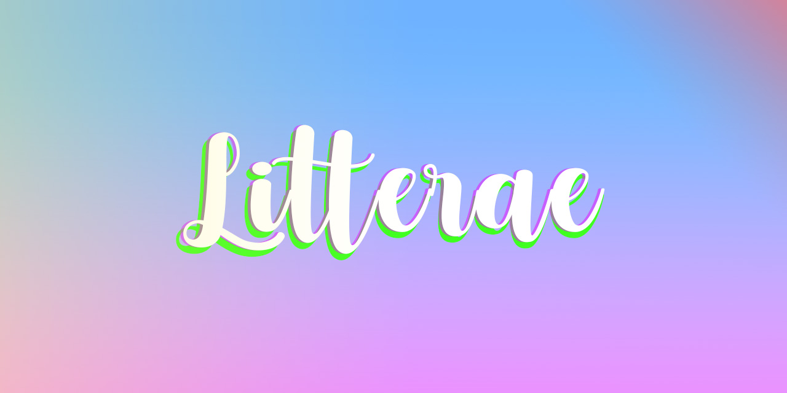

# Litterae - A arte de desenhar letras!
  
 ### [Confira nosso site!](https:/litterae.ga/home)

Site realizado para contriubuir com o trabalho de Sara Soares, e também para me ajudar nos estudos de PHP da faculdade.
A ídeia era ser algo simples, que ela pudesse gerenciar sozinha com uma área administrativa, onde poderia gerenciar todas as publicações realizadas no seu portifólio, e acompanhar solicitações de orçamento.

>O site está totalmente funcional e responsivo, mas ainda não é um trabalho finalizado.

